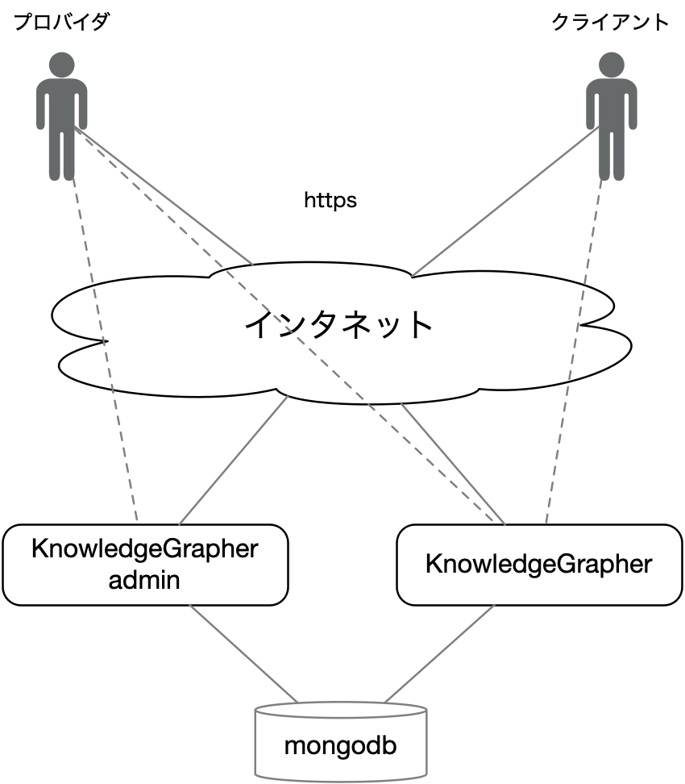
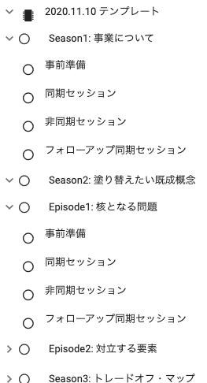
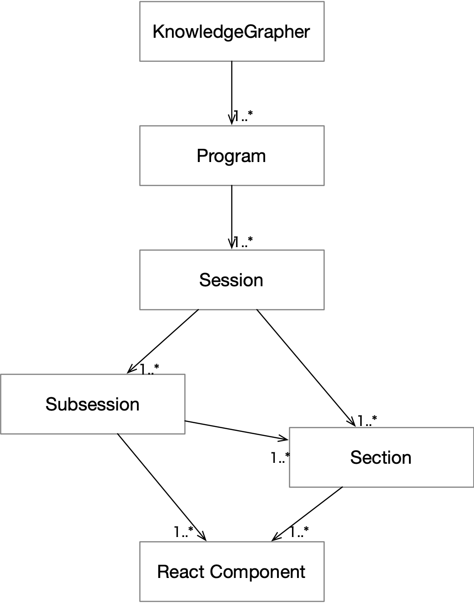
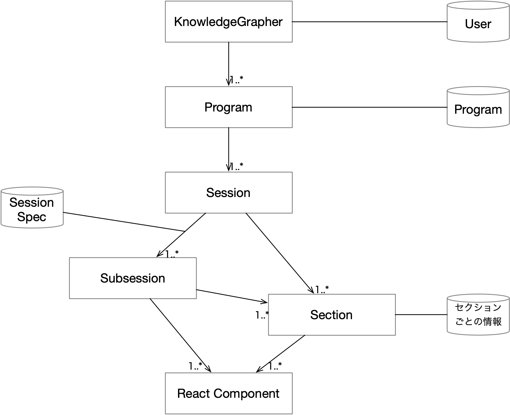

# KnowledgeGrapher 仕様書

- SubmittedTo: 株式会社レジリエンス
- SubmittedFrom: 有限会社メタボリックス
- Author: 山田正樹 (有限会社メタボリックス)
- CreatedAt: 2020 年 10 月 1 日
- UpdatedAt: 2020 年 12 月 1 日

このドキュメントでは KnowledgeGrapher の仕様について述べる. なお, `[]` の中の数字は KnowledgeGrapher 提案書の対応する項目を示す.

[TOC]

## 全体アーキテクチャ [7, 8]

基本構成は以下のようにする.

- KnowledgeGrapher (本体)
- KnowledgeGrapher admin (ユーザ管理)
- mongodb (データベース管理システム)



## 言語, フレームワーク, ライブラリ [7, 8]

要素技術として, おもに以下の言語, フレームワーク, ライブラリ, 技術標準などを利用する.

- [JavaScript](https://developer.mozilla.org/ja/docs/Web/JavaScript) (ヴュー, サーバ)
- [Node.js](https://nodejs.org/ja/) (サーバ)
- [Meteor](https://www.meteor.com/)/[Vulcan](http://vulcanjs.org/) (ヴュー, サーバ)
- [React](https://ja.reactjs.org/) (ヴュー)
- [GraphQL](https://graphql.org/)/[Apollo](https://www.apollographql.com/) (ヴュー, サーバ)
- [Syncfusion React](https://ej2.syncfusion.com/home/react.html#platform) (ヴュー・コンポネント)

## 配備 [7, 8]

KnowledgeGrapher および KnowledgeGrapher admin は, [meteor up](https://github.com/zodern/meteor-up) を用いて, パブリック・クラウド (Amazon Web Service, Google Cloud Platform など) 上の仮想サーバや, データセンタ内のレンタル・サーバに配備することができる.

Mongodb (データベース), ネームサーバ, HTTPS 認証サーバなどは必要に応じて, それぞれ別途設定する必要がある.

KnowledgeGrapher, KnowledgeGrapher admin は, セキュリティ上, クライアントごとに異なるサーバに配備することを前提としている.

## ユーザ [1]

ユーザは, 一つ以上のアカウントを持つ. アカウントは, 少なくとも以下の情報を持つ.

- ユーザ名
- メイル・アドレス
- パスワード

またデフォルトで admin, member のいずれかのグループに属する (admin は member でもある). 実際には guest という非ログイン・ユーザが属するグループがあるが, KG ではこのグループは無効である.

### ユーザ・アカウントの作成, 変更, 削除

KnowledgeGrapher admin に admin としてログインすると, 以下の手順でユーザ・アカウントを作成することができる.

1. `Users` ページの `Send Invitation` ボタンから, アカウントを作成するユーザのメイル・アドレスに招待を送る
2. 招待メイルを受け取ったユーザは, メイル中の `招待に応じる` リンクをクリックする
3. ユーザがリンク先で, 姓名, パスワードを入力するとアカウントが作成される

member ユーザは, KnowledgetGrapher の `Edit Account` メニューから自分のアカウントの情報の一部を変更することができる.

admin ユーザは,  KnowledgetGrapher の `Users (admin)` メニューからすべてのユーザのアカウントの情報の一部を変更したり, 削除することができる.

## プログラム [2]

admin ユーザは, プログラムを定義, 編集することができる.

プログラムは JSON で表現する. そのフォーマットはおおよそ以下の通りである.

```json
{
  "title": "例題",
  "subtitle": "デモンストレーション",
  "fromDate": "2020年10月1日",
  "toDate": "2021年1月31日",
  "organization": "XXXX電機株式会社第一事業部",
  "children": [
    {
      "name": "Season1: 事業について",
      "id": "1",
      "children": [
        {
          "name": "事前準備",
          "id": "1-1",
          "componentName": "CFPrepSession"
        },
        {
          "name": "同期セッション",
          "id": "1-2",
          "componentName": "CFSyncSession"
        },
        {
          "name": "非同期セッション",
          "id": "1-3",
          "componentName": "CFAsyncSession",
          "nodeLabels": ["論点", "意見", "根拠"],
          "edgeLabels": ["賛成", "中立", "反対", "問題提起", "別の視点", "質問", "答え"],
          "type": "abstraction"
        },
        {
          "name": "フォローアップ同期セッション",
          "id": "1-4",
          "componentName": "CFFollowupSession"
        }
      ]
    },
    // ...
  }
}

```

- `title`, `subtitle`, `fromDate`, `toDate`, `organization` はプログラムの先頭ページに表示される
- `children` で構造を再帰的に定義できる
- 各ノードは, `name`, `id` を持つ
  - `name` は随時変更できる
  - `id` はプログラム全体で一意でなければならない. またプログラム実施中に変更できない
- `componentName` を持つノードは末端ノード (`children` を持たない) で，`componentName` で指定される種類の Web ページ (セッション) に対応する
  - 指定できる `componentName` には, 以下の四種類がある
    - CFPrepSession
    - CFSyncSession
    - CFAsynSession
    - CFFollowupSession
  - セッションの種類によっては, 付加情報 (上記例では `nodeLabels` など) を必要とする場合もある

ユーザは, KnowledgeGrapher ホームページに表示されるプログラムの中から一つを選んで参加することができる.

プログラムを選択すると, そのプログラムの全体構造が KnowledgeGrapher ホームページの左サイドバーに表示される (下図参照).



ユーザがこの中の一つのセッションをクリックすると, 当該セッション・ページに飛ぶ.

## セッション [3]

セッションは, コンサルティングやトレーニングにおいて一度に行われる単位 (日や課) に相当するもので, KnowledgeGrapher では 1 ページ以上の Web ページで構成される.

セッション中の一つの Web ページを _サブセッション_ と呼ぶ. セッションやサブセッションの一つの Web ページは一つ以上の _セクション_ から構成される. サブセッションとセクションの違いは, サブセッションはそれだけで一つの Web ページであるが, セクションは一つの Web ページの構成要素にすぎないということである.

サブセッションやセクションは, 最終的には複数の React コンポネントから構成される.



### セッションの種類

- 準備セッション
- 同期セッション
- 非同期セッション
- フォローアップセッション

### サブセッションの種類

- テキスト/ダイアグラム・サブセッション
- 割り当てサブセッション
- 回答セブセッション
- フレームワーク図サブセッション
- ネットワーク図サブセッション

### セクションの種類

- フレームワーク図セクション

- ネットワーク図セクション
- Google Form セクション
- チャット・セクション
- チーム・セクション
- ダイアグラム・セクション
- テキスト・セクション

## ダイアログ・ヴュー [4]

ダイアログ・ヴューは, 対話や図を表現するサブセッション/セクションである. 役割やユーザによって, 読み書きを制御することができる.

- 複数種類のノード (箱) とそれらをつなぐエッジ (線) を描くことができる
- ノード/エッジにラベルを書くことができる
- ノードを移動したり, 大きさを変えたり, 回転させたりすることができる
- いったんノードに接続したエッジは, ノードを移動などしても接続している
- 複数種類のノードやエッジは, _パレット_ 上に置かれ, ドラッグ & ドロップで図上に置くことができる
- _概要図_ 上の枠を移動したり, 大きさを変えることによって, 図の表示領域を変えることができる
- ノード/エッジの作成/削除/変更などに関して undo/redo できる
- 図を書き出すことができる
- 図を印刷することができる
- 右クリックによってコマンドをメニュー表示できる

ネットワーク図では, 対話を表現するために, ノード/エッジの種類/ラベルを制限する (プログラムで定義できる).

## テキスト [5]

テキストは, テキストを入力/表示するセクションである. 役割やユーザによって, 読み書きを制御することができる.

- 文字装飾 (太字, 斜字, 下線)
- パラグラフ選択 (パラグラフ, ヘッダ 1-4, コード, 引用)
- 寄せ (左, 右, 中央, 均等)
- リスト (数字, バレット)
- リンク (URL, 図)
- undo/redo
- HTML 表示

## チャット [6]

チャットは, ユーザ間の短い会話を行うセクションである. 役割やユーザによって, 読み書きを制御することができる.

チャット・セクションは, セッション/サブセッション中の任意の場所にチャット起動ボタンとして設置することができ, その場所 (セッション/サブセッション/セクション) に関する専用の会話場所として機能する.

## データ [2, 3, 7]

KnowledgeGapher では, プログラム/セッション/サブセッション/セクションはそれぞれ自分自身に関するデータを持つ. データは, mongodb に格納される.

以下の種類のデータがある (末尾の `()` 内はデータのオーナを示す).

- GoogleForms - Google Form に関する情報を保存する (GoogleForm・セクション)
- KGChats - チャットの会話を保存する (チャット・セクション)
- KGSessionSpecs - セッションからサブセッションに受け渡されれる情報を保存する (各セッション)
- KGTeams - 課題の割り当てに関する情報を保存する (チーム・セクション)
- KGTouches - チャットの最終読み出し時刻を保存する (チャット・セクション)
- Programs - プログラムを保存する (プログラム)
- SimpleDiagrams - 図を保存する (ダイアグラム・セクション)
- SimpleTexts - テキストを保存する (テキスト・セクション)
- Users - ユーザ情報を保存する (ユーザ)



## ガイダンス [9]

ユーザが KnowledgeGrapher を利用するためのガイダンス情報を Web 上で提供する.